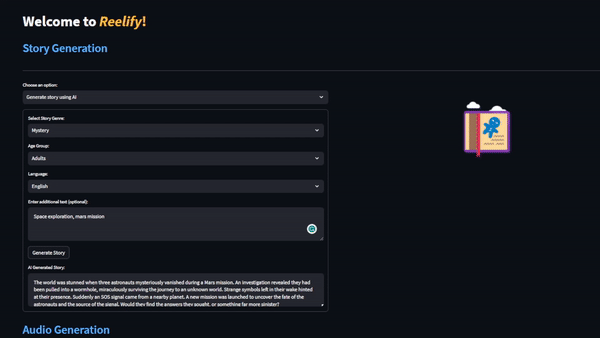

---

## VoiceUp Application

From Text to Vivid Reels: Reelify Makes AI Magic!



### Prerequisites

To run VoiceUp, you need:

- Docker (https://www.docker.com/products/docker-desktop)
- Docker Compose, which is included with Docker Desktop for Mac and Windows, but needs to be installed separately for Linux (https://docs.docker.com/compose/install/)
- Git (https://git-scm.com/book/en/v2/Getting-Started-Installing-Git)

### Getting Started

Follow these steps to get VoiceUp up and running:

1. **Clone the repository**
   ```
   git clone https://github.com/DLOVRIC2/voiceup
   ```

2. **Navigate to the repository directory**
   ```
   cd voiceup
   ```

3. **Build the Docker images**
   ```
   docker-compose build
   ```

4. **Start the Docker containers**
   ```
   docker-compose up
   ```

   This will start the Python app and the PostgreSQL database. You can access the Python app at http://localhost:8501.

To stop the application, use the command `docker-compose down`.

### Troubleshooting

If you face any issues, check:

- Your Docker version: Ensure that your Docker version is up-to-date.
- Dockerfile paths: Ensure the paths specified in the `docker-compose.yml` are correct.

---